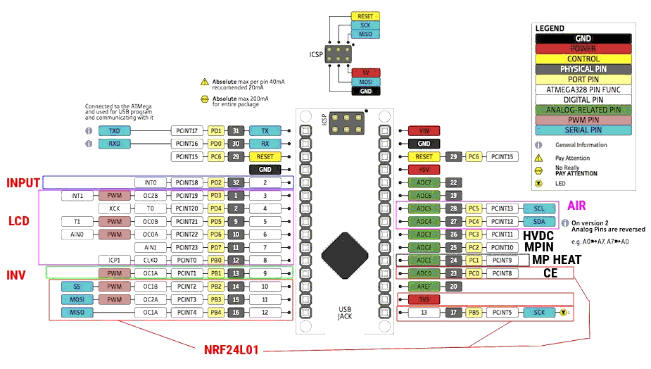

Radex 0.1 for AVR Boards
===========================================

Please burn MiniCore bootloader (8Mhz, Internal clock)

# What for?
To-do ;)

# Quick links
Copyrights and developments belong to the [Arduino project.](https://github.com/arduino/)

Based from [ArduinoCore-avr-lib](https://github.com/Millisman/ArduinoCore-avr-lib)
